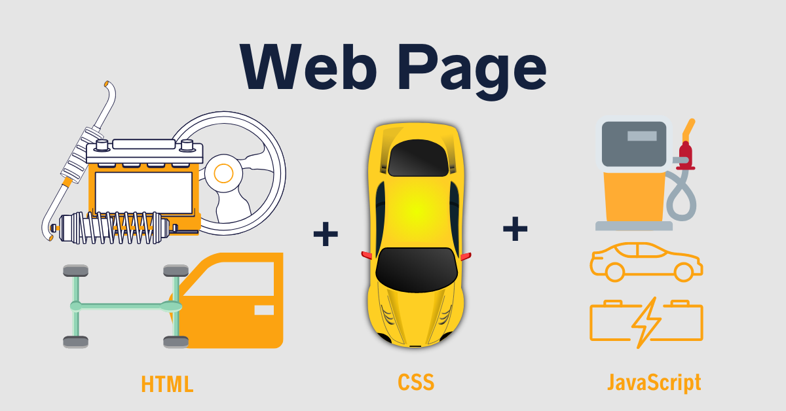

# Introduction to Web Development

## Overview

Web development involves creating and maintaining websites and web applications. This field is divided into two main areas:

- **Front-end development:** Deals with the user interface and experience.
  

- **Back-end development:** Focuses on server-side logic, databases, and application integration.
  

## Introduction to Web Development

Web development is the process of building and maintaining websites. It includes web design, web content development, client-side/server-side scripting, and network security configuration. Web development ranges from creating plain text pages to complex web applications, social network applications, and electronic business applications.

## VS Code

Visual Studio Code (VS Code) is a free, open-source code editor developed by Microsoft. It's lightweight yet powerful, offering features like syntax highlighting, debugging, and Git integration. It supports various programming languages through extensions.

## HTML, CSS, and JavaScript/TypeScript Basics



### HTML (HyperText Markup Language)

HTML is the standard language for creating web pages. It uses elements to structure content. Each element consists of a start tag, content, and an end tag.

#### Basic HTML Structure

```html
<!DOCTYPE html>
<html lang="en">
  <head>
    <meta charset="UTF-8" />
    <meta name="viewport" content="width=device-width, initial-scale=1.0" />
    <title>Web Development Introduction</title>
  </head>
  <body>
    <h1>Welcome to Web Development</h1>
    <p>This is a paragraph of text.</p>
  </body>
</html>
```

### CSS (Cascading Style Sheets)

CSS is used to style HTML elements. It controls layout, colors, fonts, and overall appearance.

#### Basic CSS Syntax

```css
body {
  font-family: Arial, sans-serif;
}
h1 {
  color: blue;
}
p {
  font-size: 16px;
}
```

### JavaScript

JavaScript is a programming language that enables interactive web pages. It can manipulate HTML and CSS, handle events, and perform asynchronous operations.

#### Basic JavaScript Example

```js
  <script>
    document.addEventListener('DOMContentLoaded', function() {
        document.querySelector('h1').textContent = 'Hello, JavaScript!';
      });
  </script>
```

### TypeScript

TypeScript is a superset of JavaScript that adds static types, helping catch errors early through a type system.

#### Basic TypeScript Example

```ts
message: string = "Hello, TypeScript!";
console.log(message);
```

## Tailwind CSS Framework

Tailwind CSS is a utility-first CSS framework that provides low-level utility classes to build custom designs without writing custom CSS.

### Using Tailwind CSS

```css
    <div class="bg-blue-500 text-white p-4 rounded">This is a Tailwind CSS styled box.</div>
```

## Next.js

Next.js is a React framework that enables several powerful features for production, such as server-side rendering and static site generation. It simplifies the process of building React applications by providing a set of tools and conventions for file-based routing, API routes, and more.

### Creating a Next.js Project

1.  **Project Structure:**

    - `pages`: Contains the pages of your application. Each file in this directory corresponds to a route.
    - `public`: Stores static assets like images.

## React

React is a JavaScript library for building user interfaces. It allows you to create reusable components that manage their own state.

### React Components

Components are the building blocks of a React application. They can be functional or class-based. Functional components are the most common in modern React development.

#### Example of a Simple React Component

```ts
    import React from 'react';
    export default function HelloWorld {
      return <h1>Hello, React!</h1>;
    };
```

## TSX (TypeScript with JSX)

TSX allows you to use TypeScript with JSX, the syntax extension for JavaScript that allows you to write HTML directly within JavaScript. TSX enhances your development experience by providing type checking and auto-completion within your JSX code.

### Example of a React Component in TSX

```ts
    import React from 'react';
    export default function HelloWorld: React.FC {
      return <h1>Hello, React with TypeScript!</h1>;
    }
```

### Using React Components in Next.js

1.  **Create a New Component:**

    - Create a file named `page.tsx` in the `app/home` directory:

```ts
      'use client'
      import React from 'react';
      export default function HelloWorld: React.FC {
        return <h1>Hello, React with Next.js!</h1>;
      }
```

## ASP .NET Introduction and RESTful API

### ASP .NET Overview

ASP .NET is a web framework for building modern web applications and services with .NET. It provides tools for building robust, scalable, and secure applications.

### Creating a Simple ASP .NET Core Web API

1.  **Create a new Web API project:**

```console
    dotnet new webapi -n MyWebApi
    cd MyWebApi
```

2.  **Run the application:**

```console
    dotnet run
```

3.  **Basic RESTful API Example:**

    - Open `Controllers/WeatherForecastController.cs`.
    - Add a new endpoint:

```csharp
    [HttpGet("hello")]
    public IActionResult GetHello()
    {
      return Ok("Hello, ASP.NET!");
    }
```

## SQL Server Introduction and CRUD Operations

### SQL Server Overview

SQL Server is a relational database management system (RDBMS) developed by Microsoft. It supports a wide range of data types and powerful querying capabilities.

### Basic SQL CRUD Operations

#### Create

```sql
    INSERT INTO Employees (Name, Position, Office, Age)VALUES ('John Doe', 'Software Engineer', 'New York', 29);
```

#### Read

```sql
    SELECT * FROM Employees;
```

#### Update

```sql
    UPDATE EmployeesSET Position = 'Senior Software Engineer'WHERE Name = 'John Doe';
```

#### Delete

```sql
    DELETE FROM EmployeesWHERE Name = 'John Doe';
```

## Connecting to SQL Server Using Entity Framework

### Setting Up Entity Framework

1.  **Install Entity Framework Core:**

```console
        dotnet add package Microsoft.EntityFrameworkCore.SqlServer
        dotnet add package Microsoft.EntityFrameworkCore.Tools
```

2.  **Create a DbContext:**

```csharp
        using Microsoft.EntityFrameworkCore;

        public class ApplicationDbContext : DbContext
        {
          public DbSet<Employee> Employees { get; set; }
          protected override void OnConfiguring(DbContextOptionsBuilder optionsBuilder)
          {
            optionsBuilder.UseSqlServer("YourConnectionStringHere");
          }
        }
        public class Employee
        {
          public int Id { get; set; }
          public string Name { get; set; }
          public string Position { get; set; }
          public string Office { get; set; }
          public int Age { get; set; }
        }
```

3.  **Add Migrations and Update Database:**

```console
        dotnet ef migrations add InitialCreate
        dotnet ef database update
```

### CRUD Operations with Entity Framework

#### Create

```csharp
    using (var context = new ApplicationDbContext())
    {
      var employee = new Employee { Name = "Jane Doe", Position = "Product Manager", Office = "San Francisco", Age = 32 };
      context.Employees.Add(employee);
      context.SaveChanges();
    }
```

#### Read

```csharp
    using (var context = new ApplicationDbContext())
    {
      var employees = context.Employees.ToList();
      foreach (var employee in employees)
      {
        Console.WriteLine($"{employee.Name}, {employee.Position}");
      }
    }
```

#### Update

```csharp
    using (var context = new ApplicationDbContext())
    {
      var employee = context.Employees.First(e => e.Name == "Jane Doe");
      employee.Position = "Senior Product Manager";
      context.SaveChanges();
    }
```

#### Delete

```csharp
    using (var context = new ApplicationDbContext())
    {
      var employee = context.Employees.First(e => e.Name == "Jane Doe");
      context.Employees.Remove(employee);
      context.SaveChanges();
    }
```

---

[Table of Contents](00-Cover.md#table-of-contents)
