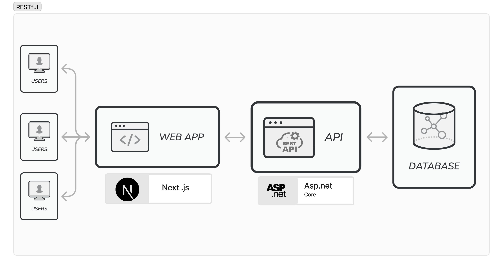

### API (Application Programming Interface)

An **API** is a set of rules and protocols that allow one piece of software to communicate with another. It defines how requests and responses should be made between software components. APIs abstract the underlying complexity of systems and provide a standardized way for different applications to interact with each other, allowing them to request and exchange data.

For example, when you use a weather app on your phone, the app communicates with a weather API to get the latest forecast information from a remote server.

### RESTful API

A **RESTful API** is an API that follows the principles of **REST** (Representational State Transfer). REST is an architectural style for designing networked applications, focusing on a set of constraints that make interactions between clients (like browsers or apps) and servers (like databases or cloud services) efficient and scalable.



#### Key Features of RESTful APIs:

1.  **Stateless**: Each API request from a client contains all the necessary information, so the server doesn't need to store any information about previous requests.

2.  **Client-Server Architecture**: The client and server are separate. The client makes requests, and the server processes them and sends back the appropriate response.

3.  **Resources and URIs**: RESTful APIs use **resources** (such as users, tickets, or products) that are identified by **URIs** (Uniform Resource Identifiers), like `https://api.example.com/users/123`. These resources are typically manipulated using standard HTTP methods.

4.  **HTTP Methods**: RESTful APIs rely on standard HTTP methods to perform actions on resources:

    - **GET**: Retrieve data from the server (e.g., get user details).
    - **POST**: Send data to the server to create a new resource (e.g., add a new user).
    - **PUT**: Update an existing resource (e.g., update user details).
    - **DELETE**: Remove a resource (e.g., delete a user).

5.  **Representation**: Resources can be represented in different formats (like JSON, XML, etc.). The most common format is **JSON** (JavaScript Object Notation) because it is lightweight and easy for both humans and machines to read and write.

6.  **Uniform Interface**: The communication between client and server is consistent and follows standard protocols, which makes RESTful APIs easy to use and scalable.

#### Example of a RESTful API Request:

- **URL**: `https://api.example.com/users/123`
- **Method**: `GET`
- **Response** (in JSON):

  ```json
  {
    "id": 123,
    "name": "John Doe",
    "email": "john@example.com"
  }
  ```

  **JSON (JavaScript Object Notation)** is a simple format for exchanging data. It uses key-value pairs, where keys are strings and values can be strings, numbers, arrays, or other objects. JSON is easy for both humans to read and for machines to process. It's commonly used in web applications to send data between a server and a client.
